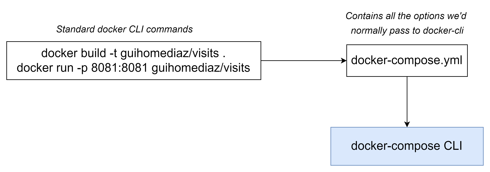
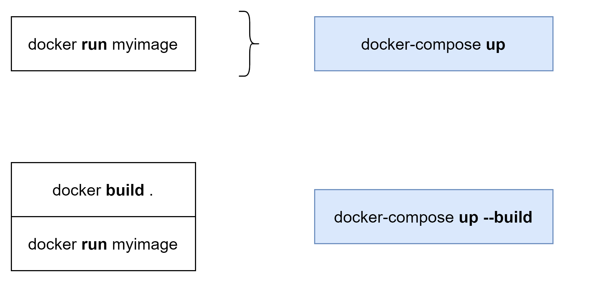
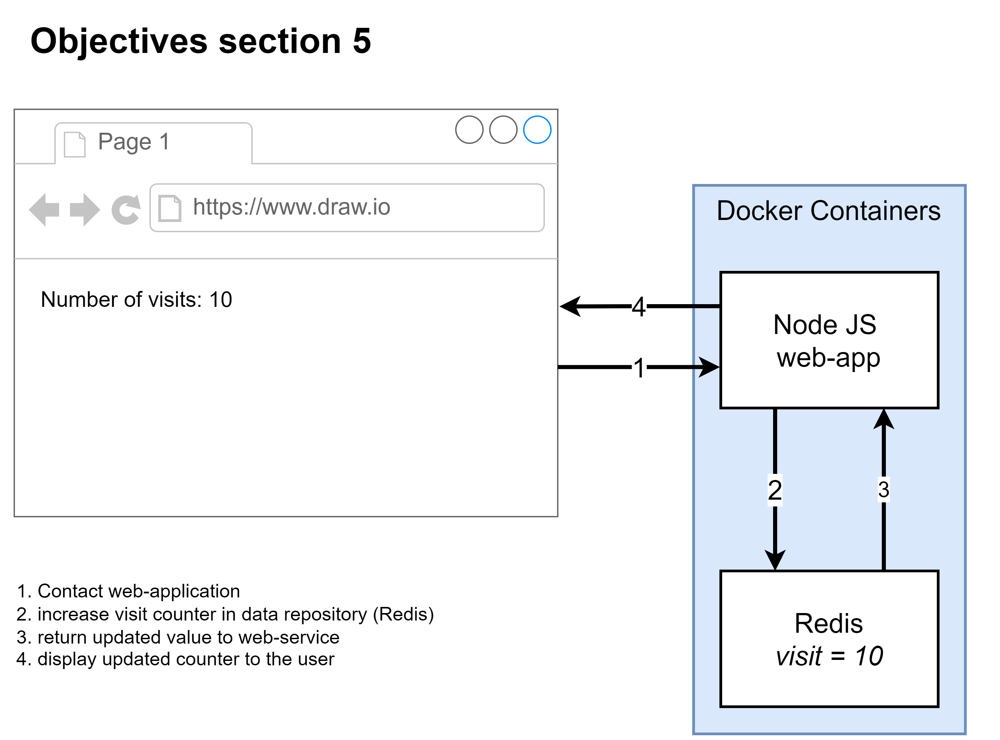
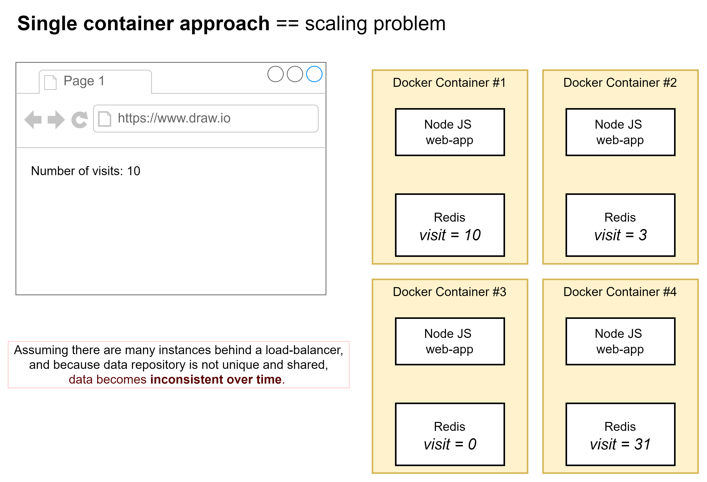
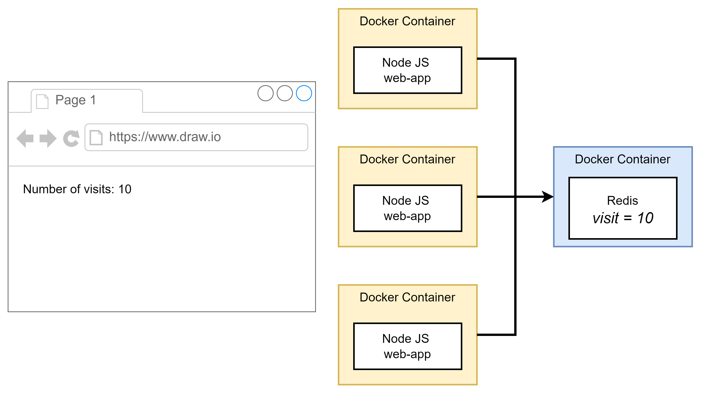
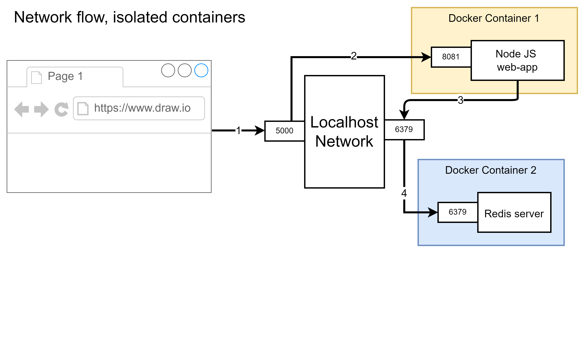

DOCKER COMPOSE: work with multiple local containers
==============

- [DOCKER COMPOSE: work with multiple local containers](#docker-compose-work-with-multiple-local-containers)
- [Docker compose](#docker-compose)
  - [Introduction](#introduction)
  - [Structure of docker-compose.yml](#structure-of-docker-composeyml)
  - [Communication between containers](#communication-between-containers)
  - [Docker compose commands](#docker-compose-commands)
    - [Arguments](#arguments)
    - [Examples](#examples)
  - [Restart containers on errors](#restart-containers-on-errors)
- [Docker-compose in action: create an application with multiples containers](#docker-compose-in-action-create-an-application-with-multiples-containers)
  - [Objectives](#objectives)
  - [Architecture option 1: single container](#architecture-option-1-single-container)
  - [Architecture option 2: multiple containers](#architecture-option-2-multiple-containers)
  - [Implementation option 1: Dockerfile + separate REDIS container](#implementation-option-1-dockerfile--separate-redis-container)
  - [Implementation option 2: docker-compose](#implementation-option-2-docker-compose)
- [Rules to follow to use multiple containers](#rules-to-follow-to-use-multiple-containers)
- [Resources](#resources)


# Docker compose

## Introduction

`docker-compose` is a separate tool to:
* **start up multiple** Docker **containers** at the same time
* **Automate** containers' creation process
* **Allow network communications** between the containers.
  * All containers will created by _docker compose_ will be in the **same network** and they're going to have **free access to communicate to each other** in any way they want. 
  * You can access a container by its _service_ name
  * You just need to specify the **port mapping for external input ports** only (to receive incoming requests).

Docker compose relies on `docker-compose.yml` file.




Usage:
* `docker-compose up` to RUN the containers ; just START them if they already exists
* `docker-compose up --build` to BUILD then RUN the containers




## Structure of docker-compose.yml 

* **Version**: there are different versions of the _docker-compose_ file syntax. During this training I am using `version: '3'`
* **Services**: a service is a _type of container_. Each service is usally a different Docker container.


## Communication between containers

Docker compose will create a **virtaul local network** between containers. 
* Each container can be accessed via its name
* The name of each container must be set in `docker-compose.yml`


Example in action


Index.js
```js
// Create Redis connection
const redisClient = redis.createClient({
    // Name of the container who acts as data repository
    host: redis-server,
    port: 6379
});
```

docker-compose.yml

```yaml
# Reminder: all containers created by docker-compose are in the *same network* and they're going to have *free access to communicate to each other* in any way they want.
services:
  # Data repository container (based on remote image)
  redis-server:
    ...

  # Our application (build image from sources)
  node-app:
    ...
```

## Docker compose commands

### Arguments
* `ps` list running containers
* `up` to **start** the containers
* `up -d` to **start** the containers in **background**
* `stop` to **stop** the containers
* `down` to **stop** and **remove** containers 
* `down --volumes` to **stop** and **remove** containers, including volumes


### Examples

* Start containers
`docker-compose up`
* List running containers
`docker-compose ps`
* Stop containers 
`docker-compose stop`

* Start all containers in background
`docker-compose up -d`
* Stop all containers, then remove them
`docker-compose down`


> All these commands must be executed in the same folder as the `docker-compose.yml` file


## Restart containers on errors

You can automatically restart containers in case of errors. There are different restart policies:

| Policy | Description  |
|---|---|
| **"no"**  | Never attempt to restart this container if it stops or crashes. This is the **default policy** assigned to all of our containers. To use it, don't forget to put the quotes around _no_ (!! otherwise YAML will interpret it as false).  |
| **always** | If this container stops *for any reason* always attempt to restart it |
| **on-failure** | Only restart if the container stops with an error code (exit code != 0). `exit(0)` == stop server on purpose ; `exit(n)` == failure == restart |
| **unless-stopped** | Always restart unless we (the developers) forcibly stop it (`docker-compose stop` or `docker-compose down`) |


---


# Docker-compose in action: create an application with multiples containers

:information_source: This is the _section 5_ exercice from the Udemy training

## Objectives

Create a NodeJS application that will count the number of times a web-page has been visited accross multiple instances.
* `multi containers` application
* NodeJS web-service
  * Expose a web-service that will return a String (~ like hello-world) on HTTP GET `/`
  * Do a `server-side console log` at each web-service call
  * `Listen` for incoming queries on `port 8080`
  * Increment the visit counter at each call
* Redis server
  * Save the visit counter

The solution must be able to scale-up!




## Architecture option 1: single container

If you package the application along the data repository, _inside_ the same container, you might end-up in such a situation: 



Assuming there are many instances behind a load-balancer, and because **data repository is not unique and shared**: data becomes inconsistent over time!! 

:fire: This is NOT a correct architecture!!

> For a **correct architecture: 1 container == 1 purpose** && isolate data repository in dedicated container


## Architecture option 2: multiple containers

To scale easier, it is better to:
* separate concerns: **1 container for 1 purpose**. 
* **Isolate data repositories** and datasources
* Only duplicate application's logic and treatment. Not the data!



:white_check_mark: With this kind of architecture you can easily scale up without data inconsistency or data loss.


## Implementation option 1: Dockerfile + separate REDIS container

We could try to: 
* _manually_ start a REDIS container 
* In parallel, build a new image for our application with a `Dockerfile`




> This option requires a **lot of manual operations** !!! It is very error-prone, fastidious and full of network issues

:fire::fire: too hard to demonstrate, and not convenient at all :fire::fire:


## Implementation option 2: docker-compose

The best approach, by far, is to use _docker compose_. You'll find an example of the [`docker-compose.yml`](./exercices/section_5/docker-compose.yml) file in exercices/section_5/

* Create `docker-compose.yml` file
* Run `docker-compose up --build` to build the image and start all containers
* Open `http://localhost:5000` in a browser to view the application (it redirects to NodeJS app port _8081_)


---

# Rules to follow to use multiple containers

When you have to work with multiple containers, you shall:
* Ensure your **applications are stateless with loose coupling**: they can run on many instances without issues
* **Separate containers** !!! 1 container == 1 purpose only
* Use **docker-compose**


---


# Resources

* [_Official documentation_ # Getting started with Docker compose](https://docs.docker.com/compose/gettingstarted/)
* [_Official documentation_ # Docker compose v3 official documentation (command lists)](https://docs.docker.com/compose/compose-file/compose-file-v3/)
* [Google cloud best practices with Docker](https://cloud.google.com/architecture/best-practices-for-building-containers#build-the-smallest-image-possible)


