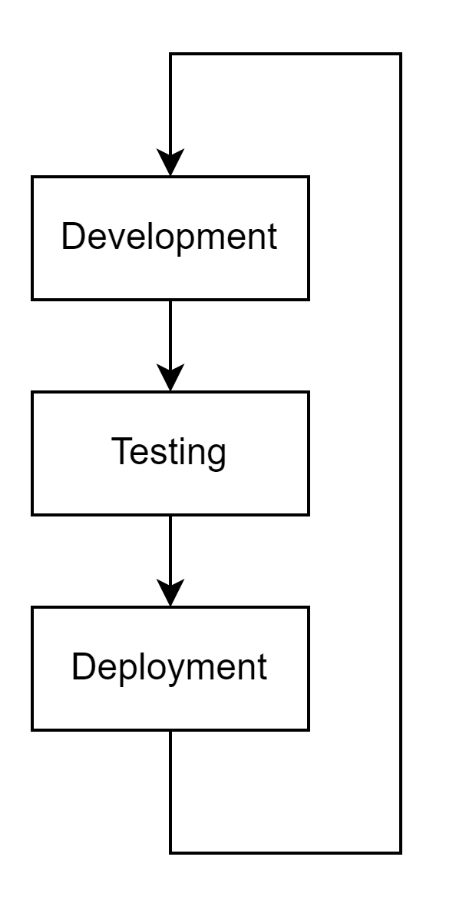

Create a real development, testing and production workflow with Docker
==============

# Application creation workflow

## Overview
This section explains how to _develop_, _test_ and _deploy_ an application with Docker. It explains how to do the **first release** and later **upgrades**, because any standard application has many releases. 

## Development workflow in details

For the sake of clarity, let's assume that we use the following:

Workflow steps:
1. New developments
    * Developers are working on a SNAPSHOT version, ex: `1.0.0-SNAPSHOT`. This means the version is not yet complete or stable.
    * Developers _commit_ and _push_ their new code in GIT **_feature branches_**
    * When the feature is complete - including unit tests - a _merge request_ is created.
2. Integrate feature into the application
    * Other developer(s) review the code, then _approve_ the changes.
    * Code changes are _pushed_ to the **_develop_** branch
    * This _push_ triggers the **Continous Integration** process: build with unit tests + quality checks.
3. Bundle application and create new release
    * Later on, when enough features are there or depending on the project due-date, another _merge request_ is created. 
    * After _approval_, the code is _pushed_ on the **_main_** branch. 
    * project version changes:
      * Main branch = release version `v1.0.0`
      * Develop branch = next development version `v1.1.0-SNAPSHOT`
    * **Continuous Integration** process is triggered: application build with tests and quality checks
    * Upon build success, branch master is **tagged** *v1.0.0* in GIT
    * **Continuous Delivery**  are triggered and changes are automatically deployed
  

Key points: 
* **You shall not create a _merge request_ to _main_ until the develop branch is stable!** Continuous Integration must be successfull (with tests and quality checks) BEFORE you push the code the _main_ branch.
* Continuous Integration (CI) can be use for all projects branches, not only _main_ or _develop_ branches

## Tooling
* GIT repository = [GitHub](https://github.com/)
* GIT client = [GIT SCM](https://git-scm.com/)
* Continuous Integration = [Travis CI](https://www.travis-ci.com/)
* Continous Deployment = [Amazon AWS](https://aws.amazon.com/)