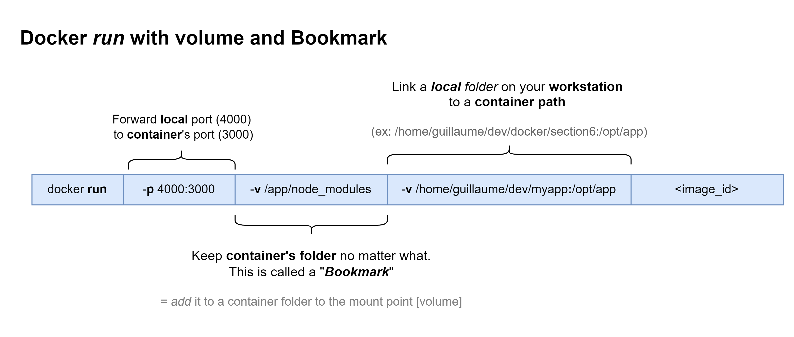

Create a real development, testing and production workflow with Docker and volumes
==============

- [Create a real development, testing and production workflow with Docker and volumes](#create-a-real-development-testing-and-production-workflow-with-docker-and-volumes)
- [Application creation workflow](#application-creation-workflow)
  - [Overview](#overview)
  - [Development workflow in details](#development-workflow-in-details)
  - [What about Docker?](#what-about-docker)
  - [Demonstration application](#demonstration-application)
  - [Create REACT frontend](#create-react-frontend)
  - [Initialize `Dockerfile.dev`](#initialize-dockerfiledev)
    - [Principle](#principle)
    - [Development with Dockerfile (no volumes, standalone container)](#development-with-dockerfile-no-volumes-standalone-container)
- [Docker volumes](#docker-volumes)
  - [Definition](#definition)
  - [Impact on development speed](#impact-on-development-speed)
  - [Usage with Docker run](#usage-with-docker-run)
- [Docker compose](#docker-compose)
- [Tooling](#tooling)


# Application creation workflow

> Even though Docker is not required to develop an application, it is very helpful! **The objective is to understand HOW to use Docker with other services to develop, build and deploy an application**.
> 

## Overview
This section explains how to _develop_, _test_ and _deploy_ an application with Docker. It explains how to do the **first release** and later **upgrades**, because any standard application has many releases. 


## Development workflow in details

For the sake of clarity, let's assume that we use the following:


Workflow steps:
1. New developments
    * Developers are working on a SNAPSHOT version, ex: `1.0.0-SNAPSHOT`. This means the version is not yet complete or stable.
    * Developers _commit_ and _push_ their new code in GIT **_feature branches_**
    * When the feature is complete - including unit tests - a _merge request_ is created.
2. Integrate feature into the application
    * Other developer(s) review the code, then _approve_ the changes.
    * Code changes are _pushed_ to the **_develop_** branch
    * This _push_ triggers the **Continous Integration** process: build with unit tests + quality checks.
3. Bundle application and create new release
    * Later on, when enough features are there or depending on the project due-date, another _merge request_ is created. 
    * After _approval_, the code is _pushed_ on the **_main_** branch. 
    * project version changes:
      * Main branch = release version `v1.0.0`
      * Develop branch = next development version `v1.1.0-SNAPSHOT`
    * **Continuous Integration** process is triggered: application build with tests and quality checks
    * Upon build success, branch master is **tagged** *v1.0.0* in GIT
    * **Continuous Delivery**  are triggered and changes are automatically deployed
  

Key points: 
* **You shall not create a _merge request_ to _main_ until the develop branch is stable!** Continuous Integration must be successfull (with tests and quality checks) BEFORE you push the code the _main_ branch.
* Continuous Integration (CI) can be use for all projects branches, not only _main_ or _develop_ branches


## What about Docker?

Docker is NOT needed to develop an application and this generic workflow can be exectued without Docker. However, even though it is not a requirement, **Docker is a tool that's going to make executing some of these development tasks and roll-out a lot, lot easier**.

## Demonstration application

For this part we will create a small _react_ application.

* Make sure you have [NodeJS](https://nodejs.org/) installed on your machine. Feel free to install the extensions, some might be needed to build the REACT project.
* Then follow the [React # Getting started with NPM](https://create-react-app.dev/docs/getting-started/#nsspx) tutorial

## Create REACT frontend

```bash
### Uninstall previous package, if you've previously installed 'create-react-app' globally 
npm uninstall -g create-react-app

### Go to your workspace directory
mkdir -p exercices

### Install latest version of the react-app
npm init react-app section_6_frontend

# Start default application and navigate to http://localhost:3000
npm start
```

Key commands:


## Initialize `Dockerfile.dev`

### Principle
We actually need **2** `Dockerfile` for this project. Both files must be at the root of the application.
* A _development_ container for `npm run start`
* A _production_ container for `npm run build`


Like _Spring_, you can create "profiles". 
* Development: `Dockerfile.dev`   ; notice the _.dev_ extension
* Production: `Dockerfile`


### Development with Dockerfile (no volumes, standalone container)

* Checkout the ["dockerfile.dev section_6"](./exercices/section_6/Dockerfile.dev)
* Docker steps

```bash
# To build the DEV docker file: 
docker build -t guihomediaz/section_6_frontend -f Dockerfile.dev .

# run the application
# (i) forward container port 3000 to local 4000
docker run -it -p 4000:3000 guihomediaz/section_6_frontend
```

:fire::fire::fire: WARNING WARNING :fire::fire::fire:

This implementation will NOT forward development changes inside the container!!!  
* There is no volume attached
* you must BUILD EVERY TIME to push your changes


# Docker volumes

## Definition

A Docker _volume_ is a placeholder inside the docker container [~ Linux mount point]. 
* From the container point of view: a _volume_ is a **_mapping_ from a mount point _inside_ the container** (ex: `/opt/app/resources`) **to a folder _outside_ the container** 
* As an outsider, the _volume_ is a set of files that are shared with the container


Volumes are very useful to:
* separate configuration files
* speed up application development
* use share drives 

## Impact on development speed

Standard Docker flow, _everything_ is inside the container:


Improved Docker flow, some files are _shared_ between workstation and container: 


Development flow with Docker:

| Without Docker volume  | With a volume  |
|---|---|
| Build image (#1) | Build image |
| Start new container (#1) | Start new container
| Do some code changes | Do some code changes |
| | Changes are immediately available for testing |
| Build new image (#2) | |
| Stop existing container (#1)  | |
| Docker run new container with latest image (#2) |
| Test changes | | 


> **Quick summary**
> Docker volumes make development **faster** with containers, and **much easier** for newcomers. Changes are **immediately** pushed and available. They allow you to **separate configuration** into another folder with secret keys, properties files and so on..
>
> Don't use volumes if you want to choose _WHEN_ the code changes are published. 
>    
>
> | Without Docker volume  | With a volume  |
> |---|---|
> | Code change are published upon request | Changes are immediately available |
> |:fire: configuration is always shared and not externalized | Custom configuration (external files, secrets, etc.) |
> | Best for testing and releases | Best for developers |


## Usage with Docker run

You can declare volume to `docker run` with argument `-v {localFilePath}:{containerPath}`. You can also add some inclusions (bookmark) `-v {containerPathToAddToVolume}`

:information_source: you can use a Linux command shortcut with `$(my_linux_command)`. 

> On windows, the shortcut command depends on the tooling
>  * PowerShell: `docker run -it -p 4000:3000 -v ${pwd}:/app IMAGE_ID`
>  * GitBash: `docker run -it -p 4000:3000 -v "/$(PWD)":/app IMAGE_ID`





examples: 
* Map workstation port 4000 -to-> 3000, 
* mount **local** folder `/home/guillaume/dev/docker/section6` to **workstation** `/opt/app`
* use image _section_6_frontend_
  ```docker run -p 4000:3000 -v /home/guillaume/dev/docker/section6:/opt/app guihomediaz/section_6_frontend``` 

* Instead of the full local path, you can use Linux commands as well:
  ```docker run -p 4000:3000 -v $(pwd):/opt/app guihomediaz/section_6_frontend``` 

* **Add bookmark**. Add an additional folder from the container to the mounted point. This folder is only accessible by the docker container.
  ```docker run -p 4000:3000 -v /opt/app/node_modules -v $(pwd):/opt/app guihomediaz/section_6_frontend``` 


:information_source: the first 2 examples will NOT work because the *node_modules* folder is only available inside the Docker container. that's why you need to use the 3rd command.

Try to adjust ["section 6 app.js"](./exercices/section_6/src/App.js) or ["section 6 index.html"](./exercices/section_6/public/index.html). Changes should be taken into account immediately.


# Docker compose

Instead of a long _docker run_ command, you can use a `docker-compose.yml` file. 
See ["docker compose section 6"](./exercices/section_6/docker-compose.yml "docker compose section 6")

> Note that _docker compose_ uses our _Dockefile_! It is just a way to simplify the run command.

This is a much better option! Don't forget to use the `docker-compose up --build` to take on _docker-compose.yml_ changes


# Tooling
* GIT repository = [GitHub](https://github.com/)
* GIT client = [GIT SCM](https://git-scm.com/)
* NodeJS = [NodeJS](https://nodejs.org/)
* Continuous Integration = [Travis CI](https://www.travis-ci.com/)
* Continous Deployment = [Amazon AWS](https://aws.amazon.com/)