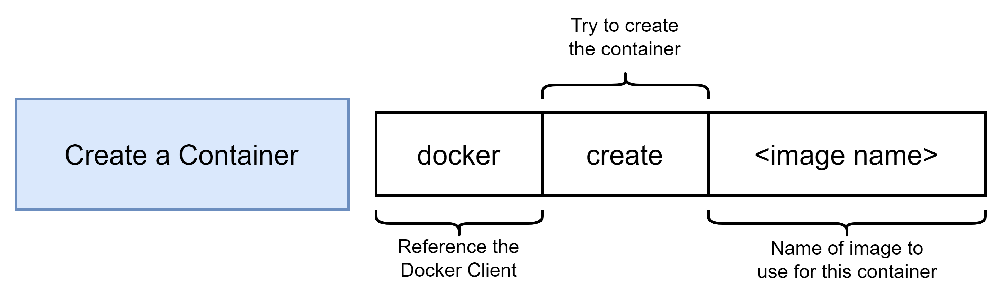
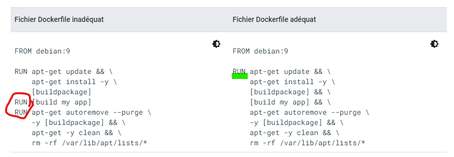

DOCKER training

- [Training notes](#training-notes)
  - [Finished Code](#finished-code)
  - [Diagrams](#diagrams)
- [Docker installation](#docker-installation)
  - [Tools](#tools)
  - [Adjust storage path for images and containers](#adjust-storage-path-for-images-and-containers)
- [Docker principles](#docker-principles)
  - [Hello-world: get image and spawn container](#hello-world-get-image-and-spawn-container)
  - [What is a container ?](#what-is-a-container-)
    - [Core concepts](#core-concepts)
    - [Container definition](#container-definition)
    - [Image definition](#image-definition)
    - [Docker application principle](#docker-application-principle)
- [Docker basics commands (lifecycle)](#docker-basics-commands-lifecycle)
  - [Docker run](#docker-run)
  - [Docker create](#docker-create)
  - [Docker start](#docker-start)
  - [Docker run VS docker start](#docker-run-vs-docker-start)
  - [Docker log](#docker-log)
  - [Docker stop](#docker-stop)
  - [Docker exec](#docker-exec)
    - [Key points](#key-points)
    - [Access container's command prompt (SH / BASH)](#access-containers-command-prompt-sh--bash)
    - [Docker exec example: redis server + redis-cli](#docker-exec-example-redis-server--redis-cli)
  - [Docker kill](#docker-kill)
  - [Docker ps](#docker-ps)
  - [Cleanup containers](#cleanup-containers)
- [Create custom docker image](#create-custom-docker-image)
  - [Introduction to _Dockerfile_](#introduction-to-dockerfile)
  - [ALPINE as base image](#alpine-as-base-image)
  - [Docker build command](#docker-build-command)
    - [Principle](#principle)
    - [Build lifecycle](#build-lifecycle)
  - [> Final image is created when there is no more docker instructions to follow.](#-final-image-is-created-when-there-is-no-more-docker-instructions-to-follow)
  - [Example: create a redis-server image](#example-create-a-redis-server-image)
- [Resources](#resources)


# Training notes

* Course: https://www.udemy.com/course/docker-and-kubernetes-the-complete-guide/
* Trainer: Stephen Grider
* Training period: 2022-01-03
* Docker setup: Windows 11 with WSL2, docker desktop v4.3.2 (72729) | docker cli v20.10.11


## Finished Code
Finished code is attached to each applicable lecture throughout the course. 

If you get stuck at any point you can download the code and compare it against yours with a diff tool like Diffchecker or VSCode's built-in comparison tool.


## Diagrams
The [diagrams](./diagrams.zip) shown in the course are attached as a zip file.
* Download the file and extract it somewhere on your computer.
* Visit diagrams.net (formerly draw.io).
* Select Open Existing Diagram 
* Use the file explorer to select the diagram file from your computer.

or

* Install and execute draw.io viewer locally
* Click on File menu, Select Open From Device
* use the file explorer to select the diagram file from your computer.


(i) Note - Please understand, if a diagram or group of diagrams is missing, this means that we no longer have them to share. You'll need to use a good screenshot tool to make a copy from the video lecture.


# Docker installation

## Tools

Make sure Virtualization is enabled in your Bios! This is one of the requirements for Windows 11.

* [Docker desktop](https://hub.docker.com/)
* Microsoft Windows WSL 2
* [Git (with gitBash)](https://git-scm.com/downloads)


## Adjust storage path for images and containers

!! **This is for Windows WSL 2 only** !!

* Source: [StackOverflow thread](https://stackoverflow.com/questions/62441307/how-can-i-change-the-location-of-docker-images-when-using-docker-desktop-on-wsl2)


The WSL 2 `docker-desktop-data` vm disk image would normally reside in: `%USERPROFILE%\AppData\Local\Docker\wsl\data\ext4.vhdx`

To relocate it to other drive/directory, with all existing docker data preserved:
* First, **shut down your docker desktop** by right click on the Docker Desktop icon and select Quit Docker Desktop
* Then, open your command prompt (GitBash)
  `wsl --list -v`

You should be able to see, make sure the STATE for both is Stopped.(wsl  --shutdown)
```bash
  NAME                   STATE           VERSION
* docker-desktop         Stopped         2
  docker-desktop-data    Stopped         2
```

Export docker-desktop-data into a file
```bash
wsl --export docker-desktop-data "D:\Dev\docker\wsl\docker-desktop-data.tar"
```

Unregister docker-desktop-data from wsl, note that after this, your ext4.vhdx file would automatically be removed (so back it up first if you have important existing image/container):
```bash
wsl --unregister docker-desktop-data
```

Import the docker-desktop-data back to wsl, but now the ext4.vhdx would reside in different drive/directory:
```bash
wsl --import docker-desktop-data "D:\Dev\docker\wsl" "D:\Dev\docker\wsl\docker-desktop-data.tar" --version 2
```

Start the Docker Desktop again and it should work

(i) You may delete the `D:\Dev\docker\wsl\docker-desktop-data.tar` file (NOT the ext4.vhdx file) if everything looks good for you after verifying


# Docker principles

## Hello-world: get image and spawn container

```bash
docker run hello-world
```

First, docker need the `hello-world` **image**.


Then, docker create a **container** (~ instance) of that particular image


Last, it executes that image.
In present case it generates a small text.


## What is a container ?

### Core concepts

A container relies on 2 concepts: 
* **Namespacing**: to isolate resources per process or group processes. A "resource" can be physical (hard-drive, network card, etc.) or logic (communication between processes, users, files rights, etc.)
* **Control group**: to limit the amount of resources used by process. To ensure a particular process stays within its limits. A "resource" can be CPU, memory, hard-drive size, etc.


!! These particular concepts are Linux specific features. Therefore **each container will run on Linux**. 

Each container, like any Linux machine, has the following input/output:
- STDIN: keyboard + mouse
- STDOUT: console output
- STDERR: error messages

You can acces the some or all input/output with Docker, depending on the command you gonna execute and its arguments.


> :fire: !! Important 
> 
> As a result of previous paradigms, _container are **completly isolated** and **separated** from each other_.


### Container definition

> *A **container** is a process or set of processes that have a grouping of resources specifically assign to it.*


### Image definition

> An **image** is composed of:
>   * *file-system* snapshot, that contains required files and folders
>   * a *startup command*


### Docker application principle

A *container* can only work on a Linux kernel. Therefore, Docker is kind of a **Linux Virtual Machine** that allows us to isolate resources through *namespacing* and *control groups*.


# Docker basics commands (lifecycle)

## Docker run

This command will spawn a new *container* for a particular *image*. `docker run` command is based on: 


To showcase the `docker run` command, we rely on ***[BusyBox](https://hub.docker.com/_/busybox/)*** a very small linux distro (between 1 to 5 Mb) with only core utilities.

* execute simple `echo`:
  ```docker run busybox echo this is test```
* execute simple `ls`: 
   ```docker run busybox ls```
* execute long process `ping`: 
   ```docker run busybox ping google.com```
* start simple linux and access the prompt directly
   ```docker run -it busybox sh```

## Docker create

To **create** a new container from a specific _docker image_: `docker create {imageName}`


* example: `docker create busybox echo hi there`
* This will:
    - Download / retrieve the corresponding _image_
    - Assign _resources_ to that particular "instance" (memory, hard-drive, etc.). This will apply _namespacing_ and _control group_ paradigms
    - Unpack the image content (files and folders) into this new space
    - Assign a particular _container ID_

## Docker start

To **start** an existing container, use its _container ID_: `docker start {containerId}`


* example: `docker start -a 5327241a353256083f18a90383acc2b7bd856e45a7490ae553375e6fc9a5af6e`
* Key points:
  - Everytime you *start* a container, the corresponding _startup command_ will be executed. 
  - :fire: you **cannot override** the default startup command
  - You can restart a stopped container
  - Don't forget to use the `-a` argument to redirect container's outputs (STDOUT, STDERR) to your local terminal!

## Docker run VS docker start

Docker **run** is just a shortcut: `docker run` = `docker create`+ `docker start`

:fire: Careful :fire:
* `docker run`
  * **redirect** all container's **output** to the current terminal automatically.
  * you can **override** the default **_startup command_** with something else
* `docker start`
  * **does NOT print anything by default**, unless you use `-a` argument. Do view the STDOUT or STDERR you must use `docker logs`
  * you **cannot change default startup** command


## Docker log

To **view** what happen inside a specific container that you did not start with `-a`, you can use `docker log {containerId}` to access the logs and all outputs (STDOUT, STDERR).


* example: `docker logs 5327241a353256083f18a90383acc2b7bd856e45a7490ae553375e6fc9a5af6e`
* Key points:
  - You can view logs from an active or stopped container 
  - `docker logs` does NOT trigger any process. It just display the system outputs
  


## Docker stop

To gracefully **stop** a container, use its _container ID_: `docker stop {containerId}`

This will send a _SIGTERM_ message to the process and shut the container down in a clean way - cleaning temporary values, saving state, etc.

> :fire: if the container does NOT stop 10 seconds max after `docker stop`, then a `docker kill` is automatically trigger by Docker Cli


## Docker exec

To **execute** an _additional_ command/process inside an existing container.


### Key points

* Don't forget to add the `-it` to forward the STDIN to the new process
* `-i` to attach the current terminal to the new process, and use STDIN
* `-t` make sure that all input text is nicely formatted (including encoding, keyboard layout, shortcuts, auto-completion, etc.)

### Access container's command prompt (SH / BASH)

With _docker exec_ you can access the container's command prompt. 

```bash
# SH default shell. It is always present.
docker exec -it {container_id} sh

# BASH, depends on the image content
docker exec -it {container_id} bash
``` 


### Docker exec example: redis server + redis-cli

[Redis](https://redis.io/) is an open source, in-memory data storage used as database, cache and message broker. The purpose of this training is NOT to learn Redis, but this is a very good example of a docker application.

Process to showcase _docker exec_:
* Get Redis server
* By default the Redis server does NOT include the `redis-cli` command
* Manually execute a new process inside the Redis server

```bash
# Start Redis server
docker run redis

# Get Redis server container ID
docker ps

# Exec new command "redis-cli" in container
docker exec -it efb6f31109ac redis-cli
```


## Docker kill

To **kill** a container, use its _container ID_: `docker kill {containerId}`

This will send a _SIGKILL_ message to the process and trigger a brute-force stop.


## Docker ps

This is one of the key command for Docker. By default, it will list all **running** containers that are currently available on the machine. But it can do so much more! 

* View **running** containers: ```docker ps```
* View **all** containers: ```docker ps --all```


## Cleanup containers

To clean containers that are STOPPED and delete all their content: `docker system prune`
* remove stopped _containers_
* remove all _virtual networks interfaces_ that are not used anymore by at least 1 container
* clear out docker _build cache_ (this might remove also the not used local images)


# Create custom docker image

## Introduction to _Dockerfile_

To create a custom docker image we have to generate a `Dockerfile`. 
> This **configuration file** defines how our container should behave. 


More specifically, this configuration file describes: 
* what different programs it is going to contain
* what it does when a container starts up

Every _Dockerfile_ contains, at least:
| | item | docker instruction |Addition info|
|-|--------------------|---------------------|----------|
|1| Base image | **FROM** | For simple stuff use the _Alpine_ base image |
|2| Add additionals commands and programs | **RUN** | There shall be only 1 RUN with `\` to chain operations |
|3| Specify a startup command to be executed after boot | **CMD** | It must be unique!! Only 1 CMD will be executed, and it is always the last one. syntax: `CMD["command", "arg1", "arg2"]` |


## ALPINE as base image

[Alpine](https://hub.docker.com/_/alpine/) Alpine Linux is a security-oriented, lightweight Linux distribution based on [musl libc](https://www.musl-libc.org/) and [busybox](https://www.busybox.net/). It contains all utilities to interact with other systems, resources and repositories + core programs. **This is the smallest and most efficient Linux kernel**. Since it is small, it is go-to choice for small containers and it can be used in production.

Key points:
* It uses its own package manager called *`apk`*
* Crystal-clear Linux environment without all the noise. Only the bare minimum (8 Mb). It keeps your environment *as small and efficient as possible*
* Alpine Linux was designed with security in mind

> `Alpine` is often use with Docker containers because of its small footprint and security.


## Docker build command

### Principle
Use `docker build` to generate the new image.
* This will parse the `Dockerfile` and apply its configuration. 
* All files and folders located in the `Dockerfile` directory will be included in the image.
* At the end of the process you shall see the container ID.

`docker build {path-to-Dockerfile}`


### Build lifecycle

:fire: :fire: !! IMPORTANT !! :fire: :fire:

When `docker build` parse the content of the `Dockerfile`, it performs the following actions: 

* FROM
  1. Retrieve from local cache/Download from docker-hub the **base image**
* RUN
  1. **Spawn a new temporary _container_** with the base image
  2. **Start** the temporary container
  3. **Execute all RUN instructions** _inside_ that temporary container.
  4. **Stop** the temporary container
  5. Take a **file system snapshot** of this temporary container
  6. **Save** snaphsot as a **temporary image**
  7. **Drop** temporary _container_
* CMD
  1. Create a **new temporary _container_ based on temporary _image_**
  2. Set the **primary command** to execute + its arguments (= content of the `CMD` instruction)
  3. **Stop** the temporary container
  4. Take a **file system + startup command snapshot** of this temporary container
  5. **Save** the snapshot as **new image**
  6. **Drop** temporary _container_

----------
> Build principle: every docker instruction relies on the previous one. 
> 
> * Each Docker instruction will spawn a **temporary container** based on last Docker instruction's result
> * It will **apply its own configuration and commands**
> * The result of these operations (filesystem + startup command) will be **saved in a temporary image** for the next Docker instruction
> * Temporary container is dropped
>
> Final image is created when there is no more docker instructions to follow.
----------

That's why, it is VERY IMPORTANT to avoid many docker operations. 



Many `RUN` will result in: 
- Bigger image filesize
- Longer builds
- Harder maintenance

> Always prefer a single RUN operation

Source: [Google Cloud Architecture, best-practices-for-building-containers](https://cloud.google.com/architecture/best-practices-for-building-containers)


## Example: create a redis-server image

1. create a new folder on your local machine to host the configuration (ex: `exercices/section3`)
2. create a new configuration file inside that folder: `Dockerfile` (no file extension). 
   ```bash 
   mkdir -p ./exercices/section3
   vim ./exercices/section3/Dockerfile
   ```

   It must contains the following structure:
   ```docker
   # Use an existing image as a base
   FROM alpine

   # Download and install a dependencies
   RUN ........

   # Tell the image what to do when it starts as a container
   CMD ["........"]
   ```
3. Build the image
   ```bash
   docker build .
   ```
   :information_source: All files and folder located in the build directory will be included in the image.

   At the end of the process you shall see the container ID.
   ```bash 
   writing image sha256:61f0bf35e165cbef3dc696b08d777c860aa036f40599cc429f1c75c94c67334f
   ```
4. Create and start a new container for that particular image
   ```bash
   docker run 61f0bf35e165cbef3dc696b08d777c860aa036f40599cc429f1c75c94c67334f
   ```


# Resources

* [Google cloud best practices with Docker](https://cloud.google.com/architecture/best-practices-for-building-containers#build-the-smallest-image-possible)

